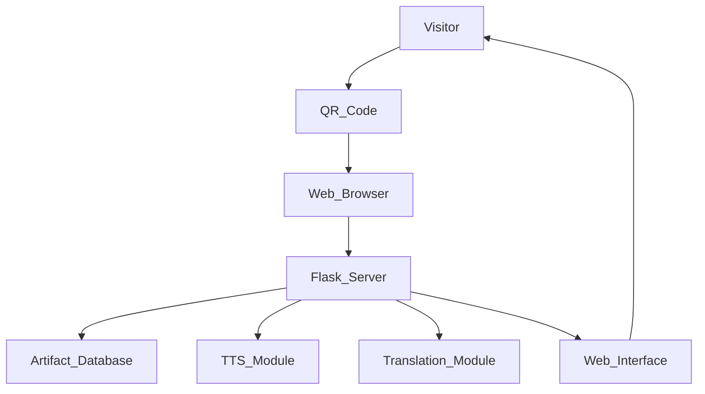

# 🏛 Multimodal Museum Guide Application

A responsive web application that enhances the museum visitor experience by providing **digital artifact guides** using QR codes.

Visitors scan a QR code placed near an artifact, which opens a web page containing:

- Artifact images
- Detailed descriptions
- AI-generated audio narration
- Multi-language translation
- Interactive interface

The system is built using Flask for backend services and Bootstrap for responsive frontend design.

---

# 📌 Project Overview

Traditional museum displays rely on printed information boards that provide limited interaction and accessibility.

The **Multimodal Museum Guide Application** solves this problem by offering a digital guide that visitors can access through their smartphones.

Each artifact in the museum has a **QR code**. When a visitor scans the code, the system retrieves artifact data and displays it through a mobile-friendly web interface.

The application also generates **AI-based audio narration** and allows **language translation** for international visitors.

---

# 🚀 Features

- QR Code based artifact access
- High resolution artifact images
- Detailed artifact descriptions
- AI generated audio narration
- Multi-language translation support
- Mobile-first responsive interface
- Lightweight and scalable architecture

---

# 🏗 System Architecture



---

# 📂 Project Structure

```
multimodal-museum-guide/
│
├── app.py
├── requirements.txt
├── README.md
│
├── data/
│   └── artifacts.json
│
├── models/
│   ├── tts_generator.py
│   └── translator.py
│
├── static/
│   ├── css/
│   │   └── styles.css
│   │
│   ├── js/
│   │   └── app.js
│   │
│   ├── images/
│   │   └── placeholder.jpg
│   │
│   └── audio/
│
└── templates/
    ├── base.html
    ├── index.html
    └── artifact.html
```

---

# 🧠 Technologies Used

### Backend
- Python
- Flask

### Frontend
- HTML5
- CSS3
- Bootstrap
- JavaScript

### AI Modules
- gTTS (Text-to-Speech)
- Google Translation API

### Database
- JSON based artifact storage

---

# ⚙ Installation Guide

Follow these steps to run the project locally.

---

## 1️⃣ Clone the Repository

```bash
git clone https://github.com/yourusername/multimodal-museum-guide.git
cd multimodal-museum-guide
```

---

## 2️⃣ Create Virtual Environment

```bash
python -m venv venv
```

---

## 3️⃣ Activate Virtual Environment

### Windows

```
venv\Scripts\activate
```

### Mac / Linux

```
source venv/bin/activate
```

---

## 4️⃣ Install Dependencies

```bash
pip install -r requirements.txt
```

---

## 5️⃣ Run the Application

```bash
python app.py
```

Open your browser and visit:

```
http://127.0.0.1:5000
```

---

# 🔗 API Endpoints

| Endpoint | Method | Description |
|--------|--------|--------|
| `/` | GET | Displays all artifacts |
| `/artifact/<id>` | GET | Shows artifact details |
| `/translate/<id>/<lang>` | GET | Translates artifact description |

---

# 📱 QR Code Integration

Each artifact QR code links to a URL like:

```
http://museum-guide.com/artifact/a1
```

Example artifact IDs:

```
a1
a2
a3
```

Scanning the QR code opens the corresponding artifact guide page.

---

# 🎧 AI Audio Narration

Artifact descriptions are converted into audio using **Text-to-Speech technology**.

Workflow:

1. Artifact description is fetched
2. Text is sent to the TTS module
3. Audio file is generated
4. Audio is stored in the static audio folder
5. The user can play the narration using the web audio player

Generated audio files are cached to improve performance.

---

# 🌍 Multi-Language Translation

The system supports dynamic translation of artifact descriptions.

Users can translate content into languages such as:

- Hindi
- Spanish
- French
- German
- Chinese

This feature helps international visitors understand artifact details easily.

---

# 🔐 Security Measures

The application includes basic security practices:

- Input validation for artifact IDs
- Sanitized translation requests
- Controlled static file access
- Separation of backend and frontend modules

---

# ⚡ Performance Optimization

The system uses several optimization strategies:

### Audio Caching
Generated audio files are stored to avoid regenerating them.

### Lightweight Database
JSON based storage reduces database complexity.

### Static File Serving
Images, CSS, and JavaScript files are served as static resources.

---

# 📊 Application Workflow

1. Visitor scans QR code.
2. QR code opens artifact URL.
3. Flask server receives artifact ID.
4. Artifact data is retrieved from the database.
5. Text-to-Speech module generates audio narration.
6. Artifact page displays image, text, and audio.
7. User can translate the description if needed.

---

# 👍 Advantages

- Improves museum visitor engagement
- Provides accessible audio guides
- Supports multiple languages
- Works on any smartphone browser
- Easy to deploy and maintain

---

# ⚠ Limitations

- Requires internet connectivity
- Translation accuracy may vary
- Audio generation may cause slight delay initially
- Large museums may require database scaling

---

# 🔮 Future Improvements

Possible enhancements for the system include:

- AI chatbot for artifact questions
- Augmented Reality artifact visualization
- Personalized visitor recommendations
- Museum visitor analytics dashboard
- Offline support within museum networks

---

# 📜 License

This project is open-source and available for educational and research purposes.

---

# 👨‍💻 Author

Project developed as part of a **Multimodal Museum Guide Application** system to enhance digital museum experiences.